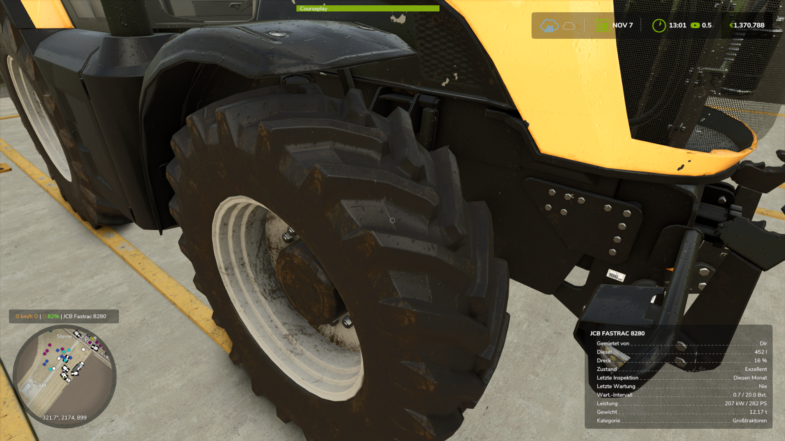
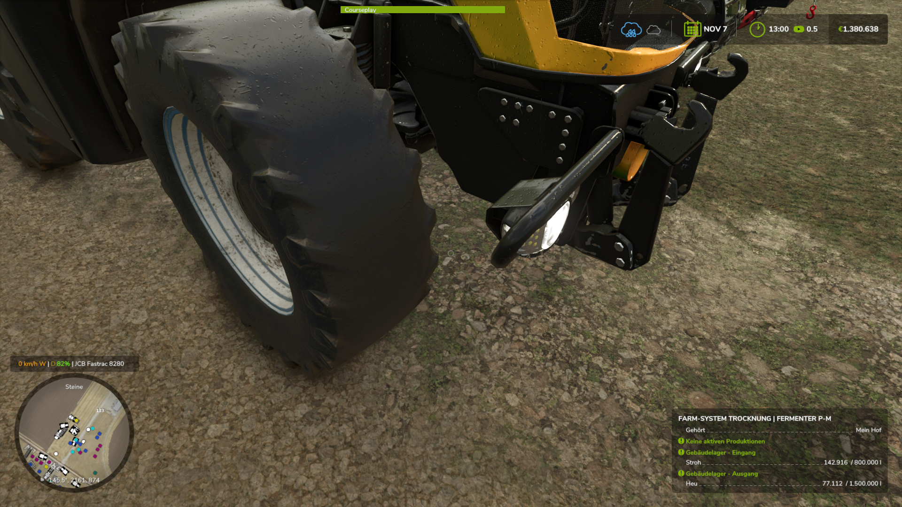
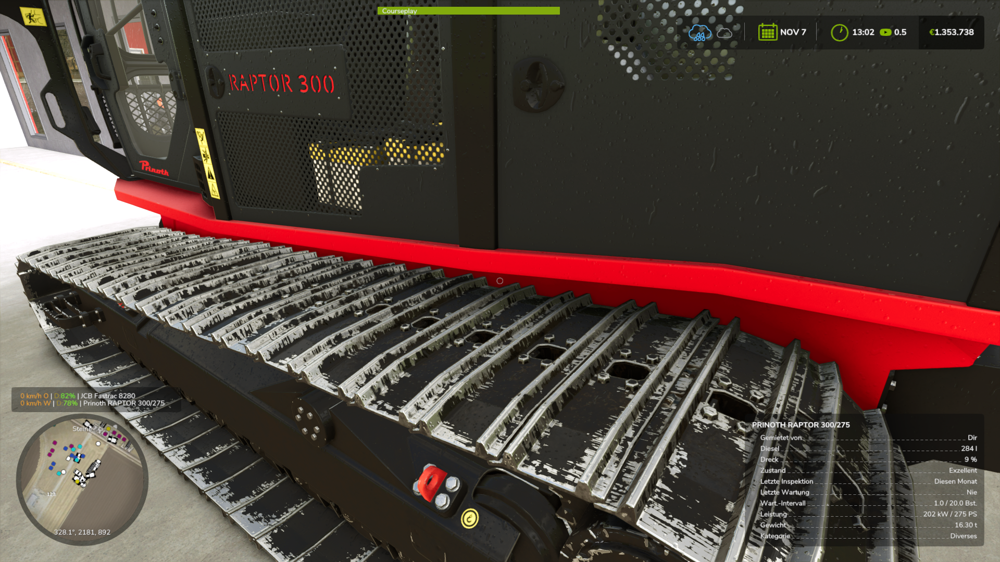
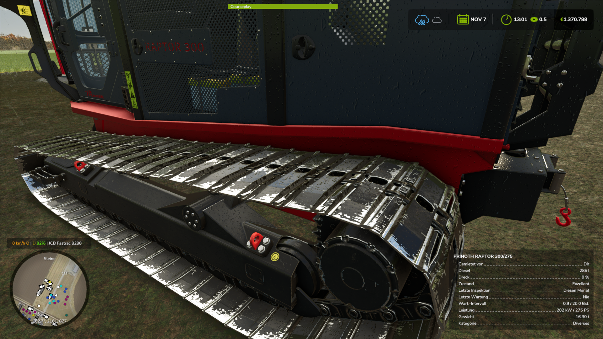
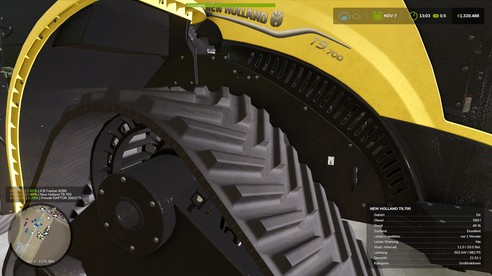
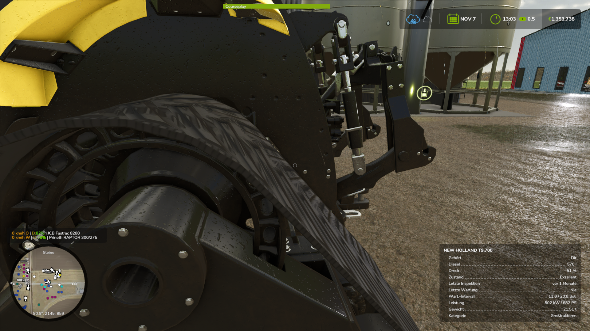
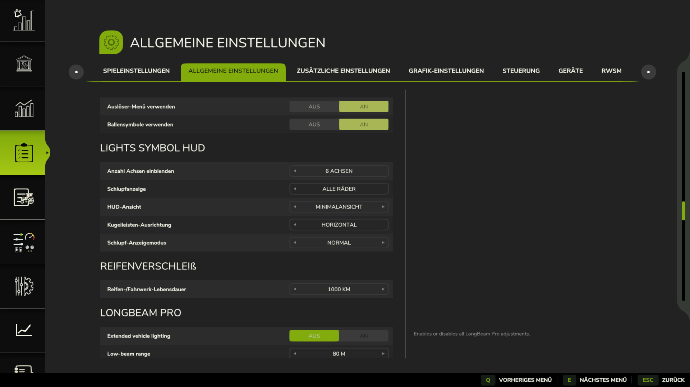

# LS25_Real_Physik_Reifenverschleiss

erweitert den Farming Simulator 25 um ein eigenständiges und deutlich detaillierteres Verschleißsystem für Reifen und Bandlaufwrke und Kettenfahrwerke.

Reifen und Raupenfahrwerke Kettenfahrwerke nutzen sich abhängig von der tatsächlich zurückgelegten Strecke, der Belastung durch Schlupf und diverse anderer Faktoren ab. Es spielt jetzt eine Rolle wie dein Fahrwrhalten ist, auf welchen Boden du unterwegs bist, welche Wettereinflüsse es gibt, welches Gewicht du bewegst und wie die dynamische Lastverteilung auf deine Räder oder Fahrwerke wirkt. Der Verschleiß wird individuell für jedes Fahrzeug und jedes Rad/Fahrwerk erfasst und gespeichert und ist damit unabhängig vom normalen GIANTS-Fahrzeugverschleiß. Das gilt für alle in deinem Hofbesitz befindlichen Fahrzeuge. Gekauft, gemietet, geleast. Ki Traffic Fahrzeuge, oder von anderen Höfen, oder Maschinen und Geräte die für eine Mission "gemietet" wurden werden nicht erfasst.

Ziel der Mod ist ein realischtische optische Verschleißabnutzung der Räder, Band und Kettenfahrwerke sichtbar darzustellen, jeweils aktuell zum tatsächlchen Verschleiß. Unterstützt werden klassische Radfahrzeuge ebenso wie Maschinen mit Gummi- und Kettenlaufwerken. Auch Anhänger und Anbaugeräte mit eigenen Rädern werden berücksichtigt und erfasst. Für Band und Kettenwahrwerke werden entsprechend ihrem tatsächlichen Aufbau auch Laufrollen in den Verschleiß mit einberechnet und seperat über ein Kombisymbol angezeigt. Getestet wurden die meisten Ingame Fahrzeuge als auch viele Mods. eine 100% kompatibilität gibt es nicht, aber weit über 90% auf jedenfall. Verzeintelt kann noch nciht alles erfasst werden, Zweiräder, Drikes, Sondermaschinen (mods)können eventuell inkompatible sein. Es wird aber weiter an der Kombatibilät gearbeitet. Für spezielle Mods benötige ich aber die Mod selber mit ihren i3d dateien und UV Masken, i3d Mapping/Shapes, sowie die Fahrzeug xmls. Nur dann kann ich schauen ob es dafür eine Machbarkeit gibt.

Mit zunehmender Abnutzung verändert sich nicht nur die optische Darstellung. Stark verschlissene Reifen verlieren zunehmend an Traktion und beeinflussen dadurch das Fahrverhalten. Es gibt jetzt eine Tragheitsverschiebung/verzögerung die dein Fahrzeug rutschen lassen. Beim Anfahren, beim Bremsen, beim Einlenken. Reifen und Fahrwerke und laufrollen können über die Werkstatt erneuert werden; die Kosten berücksichtigen unter anderem Fahrzeugtyp, Anzahl und Größe der Reifen bzw. Laufwerkskomponenten und es gibt einen kleinen Faktor abhängig des gewähltem Kilometer-Referenzwertes.

Die gewünschte Referenz-Lebensdauer kann in den Einstellungen angepasst werden. Zur Auswahl stehen 350, 500 und 750 km für kleinere bzw. klassische 2×2-Maps sowie 1000, 1500 und 2000 km für größere 4×4-Maps und entsprechend längere Einsatzzeiten. Wichtig zu wissen ist, das 1000km nicht bedeuten der Reifen/Fahrwerk hält mindestens 1000km, der Referenzwert ist die Berechnungsgrundlage für die Verschleißabnutzung. Der Reifen wird daher eher weniger halten, kann aber auch länger halten. Das liegt jetzt am Fahrverhalten und Arbeitstätigkeit und Belastung.

Weiterhin unterstützt die Mod die Verschließberechnung über Ki gesteuerte Fahrzeug, also Courseplay, Autodrive und Giants KI. Damit dies sauber funktioniert wurde von mir eine elektronische Wegfahrsperre entwickelt die speziell dazu das Fahrzeug bis nach der Startphase und Initialisierung aller Systeme, blickiert und von außen keinen Eingriff zulässt. Dies ist notwendig da CP und AD die eigens von Giants vorgesehen Startphase umgehen. Daher könnte es sonst zu unsauberen Zuständen kommen, und zu ungewollten Problemen. Stell dir einfach eine Parkbremse 2.0 vor, sobald das Fahrzeug startbereit ist, schaltet sich die EWFS ab und alles ist wie immer.

Es gibt zu dem 3 Malis in der Mod. Erstens einen Traktionsverlust der Reifen und Fahrwerke je nach deren Abnutzungszustand. Es wird aber so sein, das man das Fahrzeug noch zur Werkstatt fahren kann, mit entsprechenden Handicap und ggf. ohne Anhänger. Als weiters gibt es ein Tempomalus im KI Mode. Der KI-Tempomat wird bis auf 20kmh gedrosselt, je nach Abnutzung, damit eine Fahrzeug/Routensteuerung noch möglich ist. Bei normalen Geschwindigkeiten ist AD mit rutschenden Reifen und Traktionsverlust nicht mehr in der Lage das auszugleichen. Wenn du das Fahrzeug manuel fährst gibt es keine Beschränkung, aber entsprechnde Handicaps.
Als drittes gibt eines einen Malus auf die maximale Geschwindigkeit bei Bandfahrwerken und Kettenfahrwerken. Je nach Abnutzung der inneren Laufrollen gibt es bis zu 50% Maximalgeschwindigkeitmalus. Wenn die Laufrollen erneuert wurden, verschwindet auch der Malus wieder.

In Verbindung mit FS25 Lights & Symbol HUD können die aktuellen Verschleißzustände direkt im HUD dargestellt werden. Rad-, Fahrwerks- und Anhängerzustände werden dabei getrennt visualisiert. Auch die entsprechenden Laufrollen werden als Kombisymbole angezeigt. Es wird daher empfohlen die Lights and Symbol HUD mit zu installieren. Wem es nicht gefällt, kann sie in den Settings auch komplett ausblenden.

<b>Wichtiger Hinweis</b>
 
Durch einen unbeabsichtigen Fehler über die verwendete KI, wurden aus der UYT Mod, Dateinamen übernommen und es wurden Dateien in meine Mod unbemerkt integriet. Nach Hinweisen darüber, habe ich nun alles behoben und die Fremddateien entfernt. Es ist nun bereinigt, hätte aber nicht ungeprüft pasieren dürfen. Fall ist damit erledigt. 
 
Aber das noch mal klarzustellen, und zusätzliche Verwirrung entgegen zu wirken:

 Ich habe die entsprechenden Shader-Dateien nochmals selbst neu erstellt. Die UyT-Mod als auch meine Mod basieren zu etwa 98 % auf demselben Shader, der von GIANTS im Spiel verwendet wird. Beide Mods erstellen also keinen vollständig neuen Shader, der den GIANTS-Shader komplett ersetzen würde sondern nutzen den bereits vorhandenen. Daraus ergibt sich zwangsläufig eine sehr hohe Ähnlichkeit der beiden Shaderdateien.
 
Das liegt auch darin begründet, dass bestimmte Funktionen und Daten innerhalb des vorhandenen GIANTS-Shaders auf vorgegebenen Strukturen und Schnittstellen aufbauen. Vereinfacht kann man sich das wie eine mathematische Formel vorstellen welche dich zur richtigen Lösung führt, und zwar nur diese. Wenn dieselben technischen Vorgaben verarbeitet werden müssen, ähneln sich zwangsläufig auch Teile des dafür notwendigen Aufbaus.
 
Darüber hinaus nutze ich den Shader nicht nur für den Reifenverschleiß, sondern habe von Anfang an auch eine Verschleißdarstellung für Gummibänder und Metallketten umgesetzt. Diese zusätzlichen Funktionen und der dazugehörige Strukturaufbau wurden für meine Mod entsprechend eigenständig erweitert bzw. neu aufgebaut. Dadurch ergeben sich weitere sichtbare und technische Abweichungen gegenüber UyT da dies dort nicht umgesetzt wurde, oder geplant war. Ich denke das es damit jetzt karer sein dürfte. 

Anzeige MOD FS25_Symbol_Lights_HUD
https://github.com/duesterelegende/LS25_Lights_Symbol_HUD/releases/tag/LS25LightSymbolHUD

keine Abnutzung des Reifen

  

 
Voll abgenutzter Reifen

  

nicht abgenutztes Kettenfahrwerk

  

Voll abgenutztes Kettenfahrwerk

  

nicht abgenutztes Bandfahrwerk

  

Voll abgenutztes Bandfahrwerk

  

  

 

Release-Version: 1.2.0
Autor: duestereLegende

